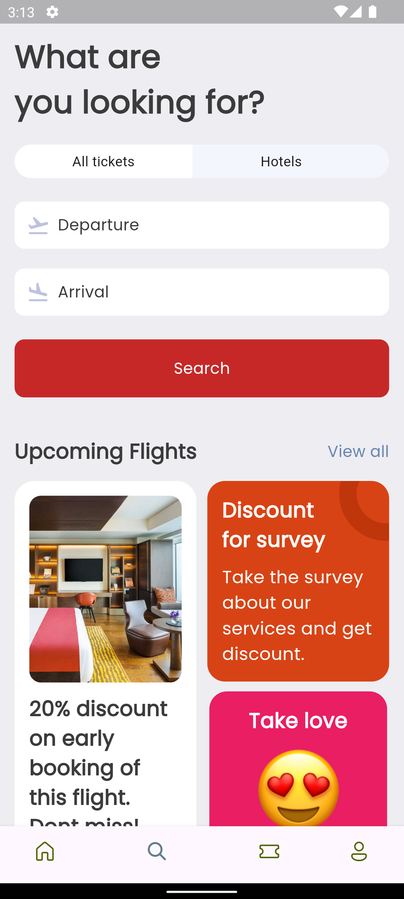
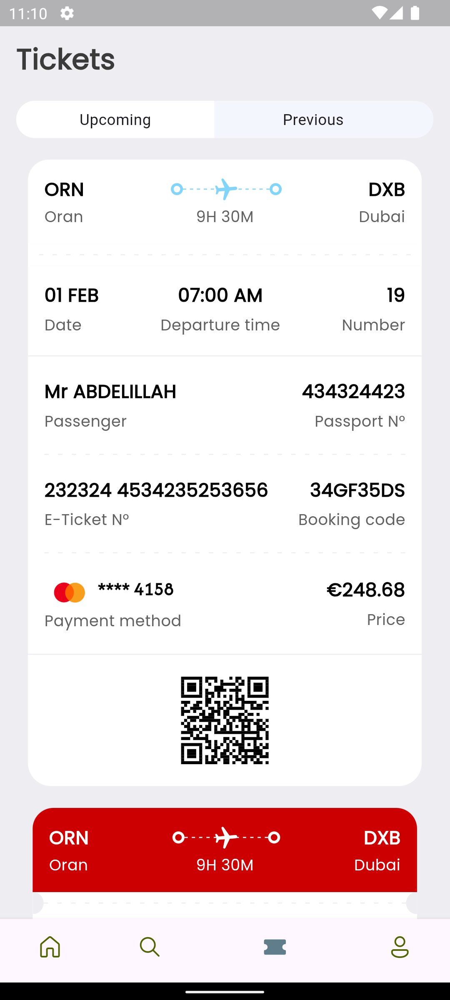

# ✈️ FlightBook: Simple Ticket Booking App

## Overview

FlightBook is a user-friendly Flutter mobile application designed for booking flight tickets effortlessly. It now includes a Django backend for data management.

## Features

### Flight Search

- [x] Search flights between cities
- [ ] Select departure and return dates
- [x] View available flights

### Seat Selection

- [ ] Choose seat preferences
- [x] View seat availability

### Booking Process

- [ ] Quick ticket reservation
- [x] Basic payment integration
- [x] Booking confirmation

## Tech Stack

- Frontend: Flutter 3.x & Dart
- Backend: Django REST Framework
- Database: SQLite (development), PostgreSQL (production-ready)

## Project Structure

- `/lib` - Flutter application code
- `/backend` - Django REST API backend

## Setup Instructions

### Backend Setup

1. Navigate to the backend directory:
```
cd backend
```

2. Install dependencies:
```
pip install django djangorestframework django-cors-headers
```

3. Run migrations:
```
python manage.py makemigrations
python manage.py migrate
```

4. Create a superuser (optional):
```
python create_superuser.py
```

5. Start the development server:
```
python manage.py runserver
```

### Flutter Setup

1. Install dependencies:
```
flutter pub get
```

2. Run the app:
```
flutter run
```

## Screenshots

<table>
  <tr>
    <td> </td>
    <td></td>
     <td> </td>
    <td> </td>
  </tr>
</table>

## API Endpoints

The Django backend provides the following API endpoints:

- Flights: `/api/flights/`
- Airports: `/api/airports/`
- Hotels: `/api/hotels/`

For detailed API documentation, see the [backend README](backend/README.md).
